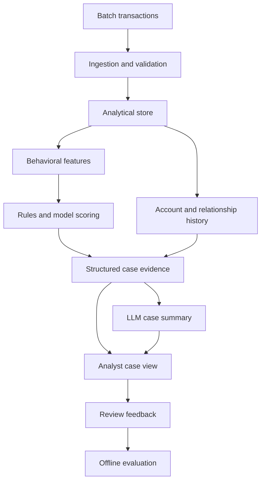

# Fraud Risk Analytics Platform

A fraud investigation project built around transaction data, account behavior, and evidence an analyst can inspect. The intended workflow scores suspicious activity, gathers the relevant history, and generates a case summary from verified findings.

**Current status: project foundation.** The sample CSV adapter, validation command, configuration, logging, and first test are implemented. Dataset selection is the next milestone. Model training, investigations, the dashboard, and deployment are planned work.

## What works today

- Read a CSV through a small, documented dataset adapter.
- Preserve account IDs, decimal amounts, and unknown labels as supplied.
- Check required fields, duplicate transaction IDs, timestamp offsets, amounts, balances, labels, and transaction categories.
- Reject unexpected columns and malformed CSV records instead of silently changing the input.
- Produce a JSON validation report with record numbers and machine-readable issue codes.
- Run the first validation test locally or through the included GitHub Actions workflow.

The six sample transactions are hand-written fictional records for checking the adapter. Their fraud labels are unknown. They are not a training dataset or evidence of detection performance.

## Run locally

Use Python 3.12 or newer. Run these commands from the repository root:

```bash
python -m venv .venv
```

Activate the environment on macOS or Linux:

```bash
source .venv/bin/activate
```

On Windows PowerShell:

```powershell
.venv\Scripts\Activate.ps1
```

Install the project and run the sample:

```bash
python -m pip install -e ".[dev]"
fraud-analytics validate data/sample/transactions.csv
python -m pytest
```

The sample validation report should be:

```json
{
  "total_rows": 6,
  "valid_rows": 6,
  "invalid_rows": 0,
  "issues": []
}
```

The module entry point is also available:

```bash
python -m fraud_analytics validate data/sample/transactions.csv
```

Logs go to stderr; the report goes to stdout. To validate another file or use a different configuration:

```bash
fraud-analytics validate path/to/transactions.csv --config configs/project.toml
```

| Exit code | Meaning |
| --- | --- |
| `0` | Every record passed validation. |
| `1` | Record validation failed, or the input has no data records. |
| `2` | Invalid command, unreadable input/configuration, or a CSV schema/format error. |

Allowed transaction categories live in `configs/project.toml`. Set the optional `FRAUD_LOG_LEVEL` environment variable to change log verbosity. `.env.example` documents environment settings; this version does not automatically load `.env` files. No API key, cloud account, or database is needed to run this milestone.

## Intended architecture

This diagram describes the target workflow, including components that have not been built yet.



Python, SQL, and models will determine the evidence. The LLM will explain that evidence. Analyst decisions and feedback will be stored separately from dataset labels.

The [architecture notes](docs/architecture.md) explain the intended components and the differences from the original reference diagram.

## Project layout

| Path | Purpose |
| --- | --- |
| `src/fraud_analytics/ingestion/` | Sample adapter and validation logic. |
| `src/fraud_analytics/cli.py` | Command-line validation entry point. |
| `src/fraud_analytics/config.py` | TOML configuration loading. |
| `src/fraud_analytics/logging.py` | Shared logging setup. |
| `configs/project.toml` | Provisional sample validation settings. |
| `data/sample/transactions.csv` | Six fictional, unlabeled transactions. |
| `tests/test_validation.py` | One test covering a mixed valid/invalid batch. |
| `docs/` | Data contract, architecture, and implementation decisions. |
| `.github/workflows/test.yml` | Installation, test, and sample-validation checks. |

The runtime uses the Python standard library. `pytest` is a development dependency. DuckDB, pandas, scikit-learn, XGBoost, NetworkX, and Streamlit will be added when their respective components are implemented.

## Development plan

| Milestone | Scope | Status |
| --- | --- | --- |
| Foundation | Packaging, adapter, validation, configuration, first test | Implemented |
| Dataset and ingestion | Select a source, document its limitations, add field mapping, store validated batches in DuckDB | Next |
| Features and detection | Historical features, transparent rules, logistic regression baseline, time-based evaluation | Planned |
| Investigation | Account history, related transactions, graph evidence, structured case records | Planned |
| Case summaries | LLM integration, evidence references, numeric consistency checks | Planned |
| Analyst application | Streamlit queue, case view, review status, monitoring | Planned |
| Deployment | Docker, persistence, AWS setup, scheduled processing | Planned |

## Data and evaluation

The [sample data contract](docs/data-dictionary.md) defines each field and its current validation rules. Those rules must be reviewed against the selected dataset; the sample contract does not establish how real bank transactions behave.

Dataset selection will consider account history coverage, timestamp resolution, counterparties, label meaning, and usage terms. Feature windows must use only information available when a transaction is scored. Evaluation will use chronological splits, keep the final test period untouched, and report precision, recall, PR-AUC, and recall at a chosen review volume.

No model has been trained, and no detection or business-impact metrics have been measured.

## Current limits

The reader holds a small CSV in memory. Validation reports issues but does not write staging tables or quarantine files. Cross-file duplicate detection, balance reconciliation, incremental ingestion, time-window features, and model scoring are not implemented. The starter test checks a mixed batch; test coverage will grow with the data pipeline.

See [implementation decisions](docs/decisions.md) for the reasons behind the initial scope and the next dataset checks.
