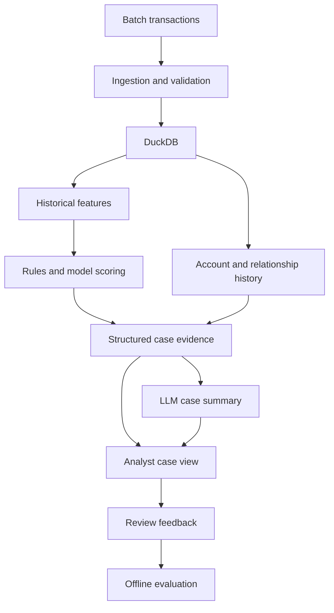

# Fraud Risk Analytics Platform

Fraud investigation needs more than a transaction flag: an analyst needs the relevant activity, the reason it was flagged, and evidence they can inspect. This project implements a local workflow in Python, DuckDB, and Streamlit: load transactions, train a baseline, inspect alerts, and save reviews.

**Current status: baseline scoring and persistent transaction review, version 0.2.0.** The app also scores newly entered transaction details. Graph investigation, LLM summaries, live ingestion, and deployment remain later milestones.

## What works today

- Import a PaySim CSV or ZIP into a local DuckDB database in one transaction.
- Check the complete input before storing it, retain exact decimal amounts, and preserve zero-amount records.
- Record the CSV fingerprint, source name, row positions, and import time. Loading the same CSV again is a successful no-op.
- Profile transaction types, supplied fraud labels, existing-rule flags, and account history coverage.
- Fit logistic regression on earlier simulation hours, choose a review threshold on a separate validation period, and score the later test period.
- Compare model alerts with two transparent rules, with measured precision, recall, and review volume.
- Inspect a ranked queue, model factors, rule reasons, and earlier activity involving either account.
- Save a review status and note, with a timestamped history that survives reopening the app.
- Enter a new transaction type, amount, and source balance to calculate a fresh score and rule checks.
- Explore simulation hours, transaction types, labels, and exact account IDs in Streamlit.
- View volume charts and a paginated transaction table using the same SQL filters as the summary.
- Continue using the original sample validation and ingestion commands.

The **Data overview** displays supplied labels; the **Review queue** displays this project's model and rule results. Labels, the source's existing flags, and analyst notes remain separate.

## Architecture

The implemented path is a source-specific importer, a DuckDB snapshot, a chronological scoring pipeline, and a Streamlit review interface. The app retrieves aggregates and bounded pages; training materializes each period's model inputs in memory.

The diagram below shows the broader target, including planned components:



See the [architecture notes](docs/architecture.md) for implementation boundaries.

## Demo

The application runs in a browser on your computer. Follow the [Windows setup guide](docs/local-setup.md) to update or install it and load your full ZIP. There is no hosted application URL yet.

Select the full database in **Dataset**, then:

1. Open **Review queue** and click **Build review queue**. The first run trains and saves the baseline locally.
2. Select an alert, inspect its evidence, and **Save review** as New, In review, or Closed.
3. Open **Try a transaction**, change the inputs, and click **Score transaction** for a new result.
4. Use **Data overview** for the original charts and filters.

If the app shows **six records**, it is using the fictional demo. The app identifies that fixture and disables training; load or select the full PaySim database first. For the uploaded CSV, the selector should show **6,362,620 records**.

## Data

[PaySim](https://www.kaggle.com/datasets/ealaxi/paysim1) is the selected synthetic transaction dataset. The profile recorded from the uploaded CSV on 2026-09-11 contains:

| Measure | Value |
| --- | ---: |
| Transactions | 6,362,620 |
| Simulation hours | 1–743 |
| Supplied fraud labels | 8,213 |
| Fraud-label prevalence | 0.129082% |
| Supplied existing-rule flags | 16 |
| Zero-amount records | 16 |
| Distinct source account IDs | 6,353,307 |
| Source IDs appearing more than once | 9,298 |

These are dataset observations, not detection results. The [PaySim contract and profile](docs/paysim.md) explain the field mapping, source fingerprint, and limitations. Run `fraud-analytics profile-paysim` to measure your own loaded snapshot.

Both files under `data/sample/` are hand-written fictional fixtures. `transactions.csv` tests the original nine-field contract and has unknown labels. `paysim.csv` tests the eleven-field PaySim adapter, including labelled records and scientific notation. Neither fixture represents the full dataset's class distribution.

Raw datasets and DuckDB files stay outside Git. The repository does not redistribute the uploaded archive; obtain it from its source and review the source's current usage terms.

## Features, detection, and investigations

The baseline uses transaction type, amount, and the source balance before the transaction. Labels, supplied flags, IDs, simulation hour, destination balances, and post-transaction balances are excluded from model inputs. Historical labels are used to fit and evaluate the model.

Training uses hours 1–323; validation uses 324–378; testing uses 379–743. Whole hours remain together. A validation score threshold targets at most 1% of validation transactions, without consulting test labels. The saved queue contains only the **918,617 test-period transactions**.

Measured on the uploaded PaySim snapshot:

| Test-period method | Alerts | Precision | Recall | False-positive rate |
| --- | ---: | ---: | ---: | ---: |
| Logistic regression | 11,316 | 23.25% | 65.68% | 0.95% |
| Either of the two rules | 182,750 | 2.18% | 99.65% | 19.54% |

Model average precision is **0.5292**. The model produces 8,685 false alerts and misses 1,375 supplied fraud labels. These are initial synthetic-data results, not production performance or calibrated probabilities. See the [model card](docs/model-card.md) for input assumptions, validation results, prevalence changes, and reproduction details.

Case evidence includes up to 20 earlier records involving either account. Same-hour and future activity are excluded. Sparse source history prevents a rich sender baseline; graph features and an evidence-grounded LLM summary are future work.

## Engineering decisions

- DuckDB runs inside Python and stores data in a local file; no separate database server is required.
- PaySim has its own table because it lacks a calendar timestamp and transaction ID. The adapter does not invent either.
- The loader hashes and reads the same temporary CSV snapshot, then validates and inserts using DuckDB's bulk execution.
- Each database contains one PaySim snapshot. A different CSV requires a new database path; existing data is not replaced.
- Amounts and balances use `DECIMAL(18, 2)`. Scientific notation is accepted only when the value fits exactly, without rounding.
- The app uses parameterized queries and bounded page results. Caches are keyed by database path, modification time, file size, and filters.
- Scaler parameters, model weights, configuration, evaluation, and test scores are saved in DuckDB. Repeating the same analysis reuses them and preserves reviews.
- Two outgoing-transaction rules check a large amount and a high share of the source balance. Rule comparisons use integer cents.

See [implementation decisions](docs/decisions.md) for tradeoffs and remaining questions.

## Run locally

Use Python 3.12 or newer and run commands from the repository root. For Windows commands that do not require environment activation, use the [setup guide](docs/local-setup.md).

On macOS or Linux:

```bash
python3 -m venv .venv
source .venv/bin/activate
python -m pip install -e ".[dev,app]"
fraud-analytics ingest-paysim data/sample/paysim.csv --database data/processed/paysim-demo.duckdb
FRAUD_DATABASE_PATH=data/processed/paysim-demo.duckdb python -m streamlit run app/overview.py
```

For the full dataset, stop Streamlit with Ctrl+C, import your ZIP, and start with the default database:

```bash
fraud-analytics ingest-paysim "path/to/archive.zip"
fraud-analytics profile-paysim
fraud-analytics analyze-paysim --config configs/detection.toml
python -m streamlit run app/overview.py
```

The full import defaults to `data/processed/paysim.duckdb`. A ZIP must contain exactly one CSV. Leave space for the expanded CSV, staging data, and database. Close other database connections before importing or running CLI analysis. You can skip the CLI analysis command and use **Build review queue** in the app instead.

The original sample workflow remains available:

```bash
fraud-analytics validate data/sample/transactions.csv
fraud-analytics ingest data/sample/transactions.csv
python -m pytest
```

It writes `data/processed/fraud.duckdb` using the separate [sample contract](docs/data-dictionary.md). Its rerun policy rejects existing transaction IDs, while PaySim reruns use the CSV fingerprint.

All commands also work as `python -m fraud_analytics <command>`. JSON reports go to stdout and logs to stderr. No API key is required. Optional shell settings are documented in `.env.example`; `.env` files are not loaded automatically.

| PaySim exit code | Meaning |
| --- | --- |
| `0` | Successful import, profile, analysis, or reuse of an identical snapshot/analysis. |
| `1` | Invalid data or analysis configuration, unsupported values, ambiguous ZIP, or a conflicting snapshot. |
| `2` | Command, file access, CSV parser, or database error. |

## Project layout

| Path | Purpose |
| --- | --- |
| `app/overview.py` | Streamlit entry point, dataset selection, and data overview. |
| `src/fraud_analytics/ingestion/` | Original sample adapter and PaySim bulk loader. |
| `src/fraud_analytics/analytics/` | Shared read-only queries and profiling. |
| `src/fraud_analytics/detection/` | Features, training, evaluation, scores, and review persistence. |
| `src/fraud_analytics/ui/` | Review queue, case evidence, and new-transaction form. |
| `src/fraud_analytics/sql/` | Packaged data, scoring, and review schemas. |
| `src/fraud_analytics/cli.py` | Validation, ingestion, profiling, and analysis commands. |
| `configs/project.toml` | Original sample validation settings. |
| `configs/detection.toml` | Chronological split, review capacity, and rule settings. |
| `data/sample/` | Small fictional fixtures for both contracts. |
| `sql/transaction_summary.sql` | SQL example for the original sample. |
| `tests/` | Validation, storage, rollback, query, and Streamlit interaction tests. |
| `docs/` | Setup, contracts, recorded dataset profile, and design decisions. |

The optional `app` dependencies include Streamlit, pandas, Plotly, NumPy, and scikit-learn. Use `.[analysis]` for command-line modelling without the interface. CI installs `.[dev,app]`, runs the tests, and checks both sample command workflows.

## Limits and next steps

This is a local, single-user batch application. There is no live transaction feed, LLM integration, graph investigation, authentication, or hosted deployment. Review notes do not change source labels or automatically retrain the model. The PaySim loader supports one complete snapshot, not incremental updates, schema migrations, or row-level quarantine. Manually editing the database can invalidate its provenance.

Next: turn the existing account evidence into structured investigation findings, add defensible relationship features, and evaluate an LLM summary grounded in those findings. Keep detection performance and investigation quality measurable separately.
