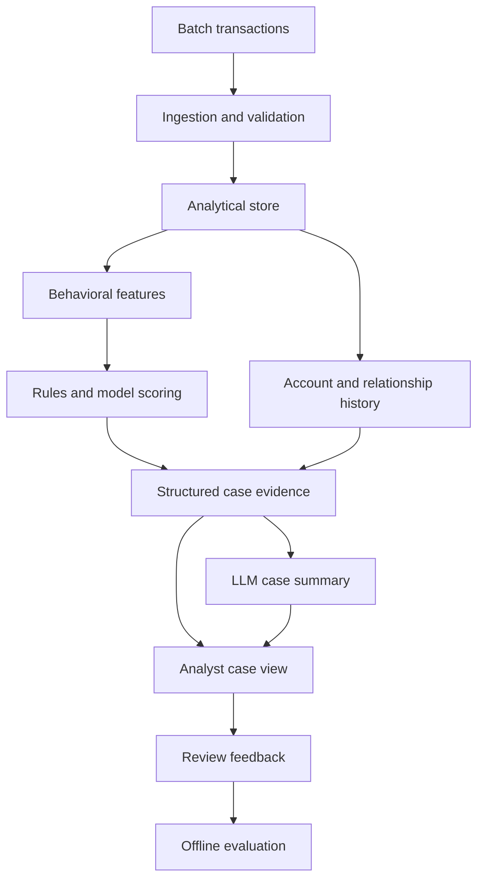

# Fraud Risk Analytics Platform

A fraud investigation project built around transaction data, account behavior, and evidence an analyst can inspect. The intended workflow scores suspicious activity, gathers the relevant history, and generates a case summary from verified findings.

**Current status: validation and local ingestion.** The sample CSV adapter, validation command, and DuckDB loader are implemented. Dataset selection is the next milestone. Model training, investigations, the dashboard, and deployment are planned work.

## What works today

- Read a CSV through a small, documented dataset adapter.
- Preserve account IDs, decimal amounts, and unknown labels as supplied.
- Check required fields, duplicate transaction IDs, timestamp offsets, amounts, balances, labels, and transaction categories.
- Reject unexpected columns and malformed CSV records instead of silently changing the input.
- Produce a JSON validation report with record numbers and machine-readable issue codes.
- Load validated batches into a persistent DuckDB `transactions` table.
- Keep IDs as text, amounts as exact decimals, and unknown labels as SQL `NULL`.
- Reject a whole load on invalid data or an existing transaction ID, preserving previously stored rows.
- Record the input path, logical CSV record number, original timestamp, and ingestion time.
- Run validation and ingestion tests locally or through the included GitHub Actions workflow.

The six sample transactions are hand-written fictional records for checking the adapter. Their fraud labels are unknown. They are not a training dataset or evidence of detection performance.

## Run locally

There is no visual application yet. Use the commands below to validate and store data, then query it through Python and SQL. For a walkthrough, see [Windows setup and viewing the data](docs/local-setup.md).

Use Python 3.12 or newer. Run these commands from the repository root:

```bash
python -m venv .venv
```

Activate the environment on macOS or Linux:

```bash
source .venv/bin/activate
```

On Windows PowerShell:

```powershell
.venv\Scripts\Activate.ps1
```

Install the project and run the sample:

```bash
python -m pip install -e ".[dev]"
fraud-analytics validate data/sample/transactions.csv
fraud-analytics ingest data/sample/transactions.csv
python -m pytest
```

The sample validation report should be:

```json
{
  "total_rows": 6,
  "valid_rows": 6,
  "invalid_rows": 0,
  "issues": []
}
```

Ingestion creates `data/processed/fraud.duckdb` and reports `"inserted_rows": 6`. DuckDB is installed with the project; no separate database server is needed. To choose another database file:

```bash
fraud-analytics ingest data/sample/transactions.csv --database data/processed/practice.duckdb
```

Loading the same transaction IDs again returns exit code `1`. It does not add duplicates or overwrite existing rows. Use a different database path for a separate copy of the sample.

The module entry points are also available:

```bash
python -m fraud_analytics validate data/sample/transactions.csv
python -m fraud_analytics ingest data/sample/transactions.csv
```

Logs go to stderr; the report goes to stdout. To validate another file or use a different configuration:

```bash
fraud-analytics validate path/to/transactions.csv --config configs/project.toml
```

| Exit code | Meaning |
| --- | --- |
| `0` | Validation passed, or the complete batch was loaded. |
| `1` | Empty/invalid batch, unsupported storage precision, or a database constraint such as an existing ID. No batch rows are added. |
| `2` | Invalid command, unreadable input/configuration, CSV schema/format error, or a database access/schema error. |

Allowed transaction categories live in `configs/project.toml`. Set the optional `FRAUD_LOG_LEVEL` environment variable to change log verbosity. `.env.example` documents environment settings; this version does not automatically load `.env` files. No API key or cloud account is needed. Database paths are relative to your working directory unless you supply an absolute path.

## Query the stored transactions

After ingesting the sample, start Python in the project environment and run:

```python
from pathlib import Path
import duckdb

with duckdb.connect("data/processed/fraud.duckdb", read_only=True) as con:
    con.execute("SET TimeZone = 'UTC'")
    con.sql("SELECT * FROM transactions ORDER BY timestamp").show()
    con.sql(Path("sql/transaction_summary.sql").read_text()).show()
```

The sample summary contains three payments totaling `60.50` and three transfers totaling `255.10`. All six labels remain unknown. Close the connection before another process writes to the database. See the [DuckDB Python documentation](https://duckdb.org/docs/current/clients/python/overview) for connection options.

## Intended architecture

This diagram describes the target workflow, including components that have not been built yet.



Python, SQL, and models will determine the evidence. The LLM will explain that evidence. Analyst decisions and feedback will be stored separately from dataset labels.

The [architecture notes](docs/architecture.md) explain the intended components and the differences from the original reference diagram.

## Project layout

| Path | Purpose |
| --- | --- |
| `src/fraud_analytics/ingestion/` | Sample adapter, validation, and transactional DuckDB loading. |
| `src/fraud_analytics/cli.py` | Validation and ingestion commands. |
| `src/fraud_analytics/config.py` | TOML configuration loading. |
| `src/fraud_analytics/logging.py` | Shared logging setup. |
| `configs/project.toml` | Provisional sample validation settings. |
| `data/sample/transactions.csv` | Six fictional, unlabeled transactions. |
| `sql/transaction_summary.sql` | Transaction totals and label coverage by transaction type. |
| `tests/` | Validation, typed storage, precision, rollback, and command checks. |
| `docs/` | Data contract, architecture, and implementation decisions. |
| `.github/workflows/test.yml` | Installation, tests, sample validation, and sample ingestion. |

The runtime dependencies are DuckDB and `pytz` for its timezone-aware Python results; `pytest` is a development dependency. pandas, scikit-learn, XGBoost, NetworkX, and Streamlit will be added when their respective components are implemented.

## Development plan

| Milestone | Scope | Status |
| --- | --- | --- |
| Foundation | Packaging, adapter, validation, configuration, first test | Implemented |
| Local ingestion | Persist validated sample batches in DuckDB; prevent duplicate IDs and partial loads | Implemented |
| Dataset selection | Select a source, document its limitations, review storage types, and add field mapping | Next |
| Features and detection | Historical features, transparent rules, logistic regression baseline, time-based evaluation | Planned |
| Investigation | Account history, related transactions, graph evidence, structured case records | Planned |
| Case summaries | LLM integration, evidence references, numeric consistency checks | Planned |
| Analyst application | Streamlit queue, case view, review status, monitoring | Planned |
| Deployment | Docker, persistence, AWS setup, scheduled processing | Planned |

## Data and evaluation

The [sample data contract](docs/data-dictionary.md) defines each field and its current validation rules. Those rules must be reviewed against the selected dataset; the sample contract does not establish how real bank transactions behave.

Dataset selection will consider account history coverage, timestamp resolution, counterparties, label meaning, and usage terms. Feature windows must use only information available when a transaction is scored. Evaluation will use chronological splits, keep the final test period untouched, and report precision, recall, PR-AUC, and recall at a chosen review volume.

No model has been trained, and no detection or business-impact metrics have been measured.

## Current limits

The reader and loader hold a small batch in memory and use parameterized inserts. This is not a bulk-loading implementation for a large dataset. Invalid batches are rejected; quarantine files, upserts, file-hash tracking, migrations, balance reconciliation, features, and scoring are not implemented.

The provisional table uses `DECIMAL(18, 2)` and microsecond timestamps. Ingestion rejects values that would lose precision. The broader `validate` command checks the source contract, so a passing validation report alone does not guarantee a file fits these storage types. Review the [data dictionary](docs/data-dictionary.md) before adapting a dataset.

See [implementation decisions](docs/decisions.md) for the reasons behind the initial scope and the next dataset checks.
