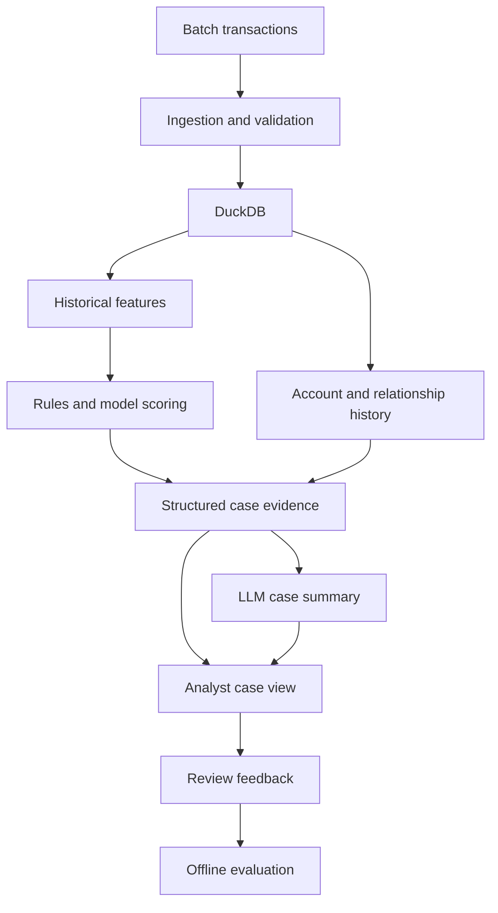

# Fraud Risk Analytics Platform

Fraud investigation needs more than a transaction flag: an analyst needs the relevant activity, the reason it was flagged, and evidence they can inspect. This project is building that workflow in Python and SQL, starting with reproducible data ingestion and exploration.

**Current status: PaySim ingestion and a local Streamlit transaction overview.** Model scoring, investigation cases, graph analysis, LLM summaries, and deployment are later milestones.

## What works today

- Import a PaySim CSV or ZIP into a local DuckDB database in one transaction.
- Check the complete input before storing it, retain exact decimal amounts, and preserve zero-amount records.
- Record the CSV fingerprint, source name, row positions, and import time. Loading the same CSV again is a successful no-op.
- Profile transaction types, supplied fraud labels, existing-rule flags, and account history coverage.
- Explore simulation hours, transaction types, labels, and exact account IDs in Streamlit.
- View volume charts and a paginated transaction table using the same SQL filters as the summary.
- Continue using the original sample validation and ingestion commands.

The overview displays supplied dataset labels. It does not generate fraud predictions.

## Architecture

The implemented path is a source-specific Python importer, a DuckDB snapshot, shared read-only SQL queries, and a Streamlit overview. Only aggregated results and one page of transactions are sent to the application.

The diagram below shows the broader target, including planned components:



See the [architecture notes](docs/architecture.md) for implementation boundaries.

## Demo

The application runs in a browser on your computer. Follow the [Windows setup guide](docs/local-setup.md) to install it, open the six-row demo, and then load your full ZIP. There is no hosted application URL yet.

The sidebar filters simulation hour, transaction type, dataset label, and exact account ID. Click **Apply filters** to update the totals, charts, and table. Searching an account includes its appearances in either source or destination fields.

## Data

[PaySim](https://www.kaggle.com/datasets/ealaxi/paysim1) is the selected synthetic transaction dataset. The profile recorded from the uploaded CSV on 2026-09-11 contains:

| Measure | Value |
| --- | ---: |
| Transactions | 6,362,620 |
| Simulation hours | 1–743 |
| Supplied fraud labels | 8,213 |
| Fraud-label prevalence | 0.129082% |
| Supplied existing-rule flags | 16 |
| Zero-amount records | 16 |
| Distinct source account IDs | 6,353,307 |
| Source IDs appearing more than once | 9,298 |

These are dataset observations, not detection results. The [PaySim contract and profile](docs/paysim.md) explain the field mapping, source fingerprint, and limitations. Run `fraud-analytics profile-paysim` to measure your own loaded snapshot.

Both files under `data/sample/` are hand-written fictional fixtures. `transactions.csv` tests the original nine-field contract and has unknown labels. `paysim.csv` tests the eleven-field PaySim adapter, including labelled records and scientific notation. Neither fixture represents the full dataset's class distribution.

Raw datasets and DuckDB files stay outside Git. The repository does not redistribute the uploaded archive; obtain it from its source and review the source's current usage terms.

## Features, detection, and investigations

These components are planned. PaySim's hour resolution does not support minute-level velocity features or an assumed ordering of events within an hour. Almost all source account IDs appear once, so long sender-history baselines would be poorly supported by this snapshot.

The next step is a leakage review and a documented chronological split before training a logistic regression baseline. Balance fields, supplied flags, and labels need explicit availability assumptions. Fit preprocessing on training data, choose thresholds on validation data, and leave the test period untouched.

Account and graph evidence must use only the history available at scoring time. A later LLM component will explain structured evidence; it will not calculate features or invent probabilities. Analyst review feedback will be stored separately from the supplied labels.

No model has been trained. Precision, recall, PR-AUC, review-volume metrics, and summary-grounding evaluation remain unmeasured.

## Engineering decisions

- DuckDB runs inside Python and stores data in a local file; no separate database server is required.
- PaySim has its own table because it lacks a calendar timestamp and transaction ID. The adapter does not invent either.
- The loader hashes and reads the same temporary CSV snapshot, then validates and inserts using DuckDB's bulk execution.
- Each database contains one PaySim snapshot. A different CSV requires a new database path; existing data is not replaced.
- Amounts and balances use `DECIMAL(18, 2)`. Scientific notation is accepted only when the value fits exactly, without rounding.
- The app uses parameterized queries and bounded page results. Caches are keyed by database path, modification time, file size, and filters.

See [implementation decisions](docs/decisions.md) for tradeoffs and remaining questions.

## Run locally

Use Python 3.12 or newer and run commands from the repository root. For Windows commands that do not require environment activation, use the [setup guide](docs/local-setup.md).

On macOS or Linux:

```bash
python3 -m venv .venv
source .venv/bin/activate
python -m pip install -e ".[dev,app]"
fraud-analytics ingest-paysim data/sample/paysim.csv --database data/processed/paysim-demo.duckdb
FRAUD_DATABASE_PATH=data/processed/paysim-demo.duckdb python -m streamlit run app/overview.py
```

For the full dataset, stop Streamlit with Ctrl+C, import your ZIP, and start with the default database:

```bash
fraud-analytics ingest-paysim "path/to/archive.zip"
fraud-analytics profile-paysim
python -m streamlit run app/overview.py
```

The full import defaults to `data/processed/paysim.duckdb`. A ZIP must contain exactly one CSV. Leave space for the expanded CSV, staging data, and database. Close other database connections before importing.

The original sample workflow remains available:

```bash
fraud-analytics validate data/sample/transactions.csv
fraud-analytics ingest data/sample/transactions.csv
python -m pytest
```

It writes `data/processed/fraud.duckdb` using the separate [sample contract](docs/data-dictionary.md). Its rerun policy rejects existing transaction IDs, while PaySim reruns use the CSV fingerprint.

All commands also work as `python -m fraud_analytics <command>`. JSON reports go to stdout and logs to stderr. No API key is required. Optional shell settings are documented in `.env.example`; `.env` files are not loaded automatically.

| PaySim exit code | Meaning |
| --- | --- |
| `0` | Complete import, identical snapshot already loaded, or successful profile. |
| `1` | Invalid dataset contract, unsupported values, ambiguous ZIP, or a conflicting snapshot. |
| `2` | Command, file access, CSV parser, or database error. |

## Project layout

| Path | Purpose |
| --- | --- |
| `app/overview.py` | Streamlit transaction overview. |
| `src/fraud_analytics/ingestion/` | Original sample adapter and PaySim bulk loader. |
| `src/fraud_analytics/analytics/` | Shared read-only queries and profiling. |
| `src/fraud_analytics/sql/` | Packaged PaySim schema and decimal validation. |
| `src/fraud_analytics/cli.py` | Validation, ingestion, and profiling commands. |
| `configs/project.toml` | Original sample validation settings. |
| `data/sample/` | Small fictional fixtures for both contracts. |
| `sql/transaction_summary.sql` | SQL example for the original sample. |
| `tests/` | Validation, storage, rollback, query, and Streamlit interaction tests. |
| `docs/` | Setup, contracts, recorded dataset profile, and design decisions. |

The optional `app` dependencies are Streamlit, pandas, and Plotly. CI installs the app and test dependencies, runs the tests, and checks both sample command workflows.

## Limits and next steps

This is a local, single-user exploration app. It has no case queue, trained model, LLM integration, authentication, review persistence, or deployment. The PaySim loader supports one complete snapshot, not incremental updates, schema migrations, or row-level quarantine. Manually editing the database can invalidate its provenance; matching row counts do not detect arbitrary manual value changes.

Next: document label availability and chronological evaluation boundaries, implement an initial feature set supported by the data, and compare a transparent rule baseline with logistic regression.
